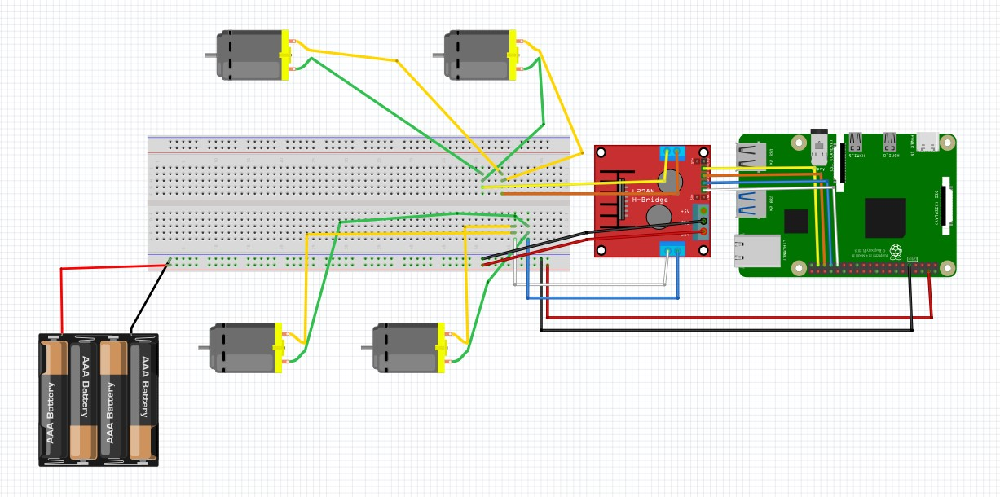
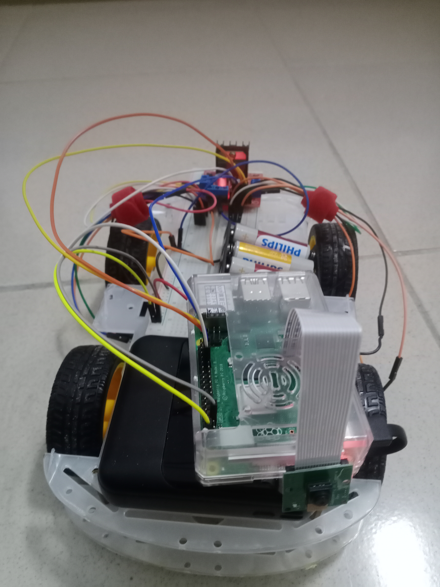

# Iot_物流運輸概念車
## 1.關於專案
這是一個可以用在物流運輸方面的遙控車，使用者可操控車子移動並觀看實時畫面。同時，車子則可記錄兩點之間的路線。此功能可應用於動線多變、不定的場景下，讓使用者客製化自己的運輸路線。
## 2.所需材料
- [雙層四驅自走車底盤](https://www.tenlong.com.tw/products/10241289256) * 1
- Rasberry Pi 4 * 1
- 麵包板 * 1
- L298N馬達驅動模組 * 1
- 1.5v電池 * 4
- 四顆並聯電池盒(包含正負極單芯線) * 1
- 穩定5V的行動電源(可用樹莓派UPS 鋰電池擴充板替代) * 1
- 數條公對公、公對母、母對母杜邦線
- 捆線帶(非必要，用於整理杜邦線)
- 雙面膠(非必要，用於固定車上裝置)
## 3.線路設計與實體照片
### 線路設計

### 實體正面

### 實體背面

## 4.程式設計

## 5.模型訓練

## 6.Demo影片
[物流運輸概念車 Demo展示](https://youtu.be/6LKaLzW9TY4)
## 7.修改方向
- 將訓練好的**物體追蹤模型部署**在樹莓派上，讓車子可追蹤特定人或物移動。如此一來，使用者便不需要再手動遙控紀錄路線。
- 目前的路線記錄功能是透過記錄使用者的操作歷程來實現，容易出現不準確的狀況。可**添加imu傳感器**，紀錄車子的速度及方向，更加準確的還原路徑。
- 可用支架把**鏡頭架高**，比較容易識別目標。
- 添加**重量感測模組**，讓使用者可設定負重閥值，並讓車子在超出負荷時執行預設的行動。
- 添加**麥克風模組**，讓使用者可透過簡單的語音指令，命令車子執行返回起點、前往目的地或停止等行動
## 8.參考資料
- [利用roboflow訓練模型](https://medium.com/@andy6804tw/%E5%BF%AB%E9%80%9F%E4%B8%8A%E6%89%8Byolo-%E5%88%A9%E7%94%A8-roboflow-%E5%92%8C-ultralytics-hub-%E5%AE%8C%E6%88%90%E6%A8%A1%E5%9E%8B%E8%A8%93%E7%B7%B4%E8%88%87%E7%AE%A1%E7%90%86-%E4%B8%8A-37acd110a8a0)
- [樹莓派腳位](https://pinout.xyz/)
- [L298n控制馬達](https://atceiling.blogspot.com/2021/04/raspberry-pi-pico10l298n.html#google_vignette)
